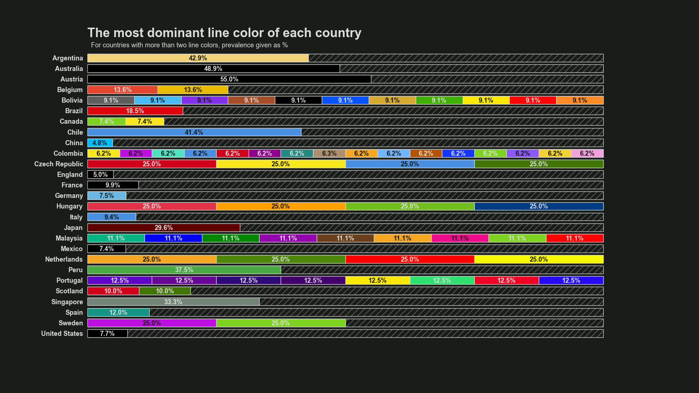

# City Lines

> This repository and the code it contains was written by Nisa İrem Kırbaç and Eren Janberk Genç as part of the requirements for completing the "Information Structures and Implications" class.


*A visualization example from the assignment. The 3D scatterplot shows all the transportation line colors. The mean color of the dataset is highlighted, and so is the most unique color.*

## What is this repository about?

This repository hosts the code that was submitted as the final assignment for the "Information Structures and Implications" class offered by KU Leuven's MSc in Digital Humanities programme in the 2021 - 2022 academic year.

The final assignment was to clean, process, analyze and visualize a dataset using SQL and Python. The deliverables were:

1. A Jupyter Notebook containing the analysis and the visualizations
2. A brief presentation that offered answers to the questions in the assignment.

The code that is responsible for the whole analysis process can be found in this repository. As the analysis was made with reproducibility in mind, **all of the steps can be retraced and recreated.**

## How do i reproduce the analysis?

Reproducing the analysis requires completing the following steps:

1. Recreating the environment that the cleaning, processing and the analysis was conducted in.
2. Running the cleaning and processing scripts.
3. Running the analysis notebook.

Executing these steps requires two pieces of software that do not come bundled with the analysis. Those pieces of software are:

1. [**Conda package manager.**](https://docs.conda.io/projects/conda/en/latest/) Conda was chosen in this project to organize and install Python dependencies.
2. **A MySQL server**. The assignment guidelines explicity stated that MySQL server must be used to locally host a SQL database in which the subject datasets are hosted. To set up MySQL server, [**XAMPP was used**](https://www.apachefriends.org/download.html).

Provided that you have the software mentioned above installed in your system, you can follow the guide below to reproduce the analysis.

### Clone or download the repository

Before recreating the analysis environment and running the analysis, you need to have the project files on your computer. You can download the source code of this project and the related material either through cloning the repository using a Git client, using GitHub desktop or through manual download.

### Recreate the environment that the cleaning, processing, analysis and visualization was conducted in

Launch the Anaconda prompt or any terminal where you can run the Conda package manager from. Use the terminal to move to the root of the project directory. Then run the following command:

`conda env create -f environment.yml`

Once this command is run, Conda will use the information provided inside the **environment.yml** file to create a new environment similar to the original analysis environment. *city-lines-env* will be name of this new environment. **The specific Python version that the analysis was conducted in is also encoded into the environment.yml file.**

**Don't forget to activate your environment before running the analysis.** You can activate the environment using the following command:

`conda activate city-lines-env`

### Run the cleaning and processing scripts

[**Doit**](https://pydoit.org/) is a handy Python package that can be used to automate data analysis workflows. This project makes use of it to orchestrate individual scripts. All the information related to structure of the analysis pipeline is located in the **dodo.py** file.

The cleaning and processing scripts take the *city-lines.sql* source file located under `data/main/...` to create the database that is used in the final analysis. To run these scripts in the correct order using Doit, do the following:

1. If you've closed the previous interpreter, open again a Python interpreter or any command line tool you can run Python from.

2. Activate the environment you created in the previous step if you haven't already.

3. Move to the root project folder, the folder in which the **dodo.py** file is located.

4. Run the following commands in order: `doit forget` and then `doit`.

### Run the analysis notebook

The analysis and the visualization code is located inside `notebooks/data-analysis.ipynb`. A .ipynb file offers an interactive coding environment where code, code output and commentary is mixed. To open this Jupyter Notebook file, you can either use a text editor/IDE capable of rendering .ipynb files or use the Jupyter Notebook viewer included in the project dependencies. Here are the instructions to do the latter:

1. Open a Python interpreter and reactivate the analysis environment if you closed the previous interpreter window. If not, continue to the next step.

2. Move to the *notebooks* folder where *data-analysis.ipynb* is found.

3. Run the following command to launch the notebook file using the Jupyter Notebook viewer: `jupyter notebook data-analysis.ipynb`.

4. Run the notebook either cell by cell or all at once using the user interface.

You can now investigate the code, code output and the commentary for each question asked for the analysis.

## Repository structure

Below is a document tree of this repository that can serve as a map for those who wish to explore further.



*A visualization example from the assignment. This styled, stacked and horizontal bar chart shows the most dominant line color(s) for each country and the percentage by which they are dominant.*

--------

```
    |
    ├── data
    |   ├── cleaned                 <- Temporarily contains the cleaned .csv files used to augment the original dataset.
    |   ├── external                <- Contains the external .csv files used to augment the original dataset.
    |   ├── main                    <- A .sql file that can be used to recreate the original dataset.
    │
    |── media                       <- Contains internally generated figures.
    |
    |── notebooks                   <- Contains the Jupyter notebook that hosts the analysis and visualization code.
    |
    ├── src                         <- Source code of this project.
    |   |── data_cleaning           <- Scripts that clean the main and external datasets.         
    │   |── data_processing         <- Scripts that gather data or transform datasets into other datasets.
    |   |── utility_scripts         <- Scripts that aid in tasks such as analysis setup and teardown.
    |      
    |── environment.yml             <- A .yml file for reproducing the analysis environment.
    |
    |── dodo.py                     <- A file that contains all the information needed to run the automation package Doit.
    |
    |── setup.py                    <- A file that contains information about the packaging of the code.
    |
    |── .gitignore                  <- A file to specify which folders/files will be flagged with gitignore
    |
    ├── LICENSE                     < - Software license.
    |
    ├── README.md                   <- The top-level README for the users of this project.
    |
```

--------
