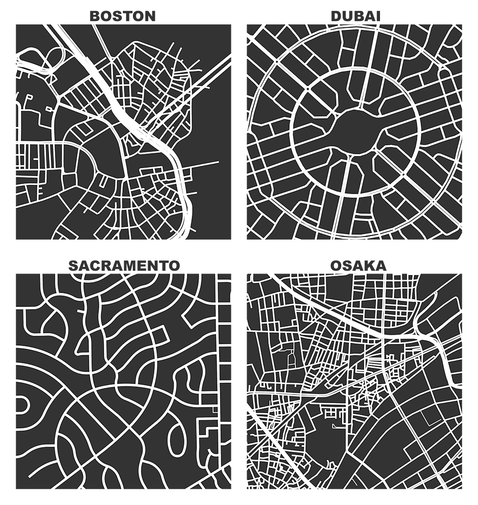

# Analysis of the "City Lines" Dataset

> This repository and the code it contains was written by Nisa İrem Kırbaç and Eren Janberk Genç as part of the requirements for completing the "Information Structures and Implications" class.

Banner image by [Geoff Boeing](https://geoffboeing.com/2019/11/big-data-urban-morphology/)

## What is this repository about?

## How do i reproduce this dataset?

## Repository structure
